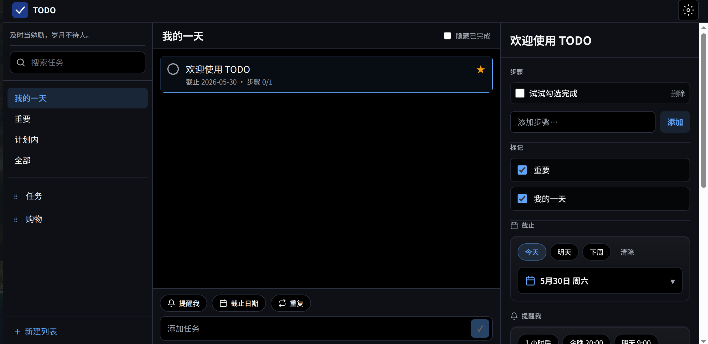

# ☑️ Open To Do

一款智能的日常任务管理应用程序，旨在帮助用户轻松规划生活和工作，让你每天都能保持专注并完成最重要的事情。



---

## 🚀 构建与运行

### 网页

```bash
npm install
npm run dev
npm run build
npm run preview
```

### Linux 桌面（Electron）

```bash
npm run dev:desktop
npm run dist:linux
npm run dist:deb
npm run electron:pack
```

### Android APP

```bash
npm run build:android
npm run android:install
cd android && ./gradlew :app:assembleRelease
```

---
